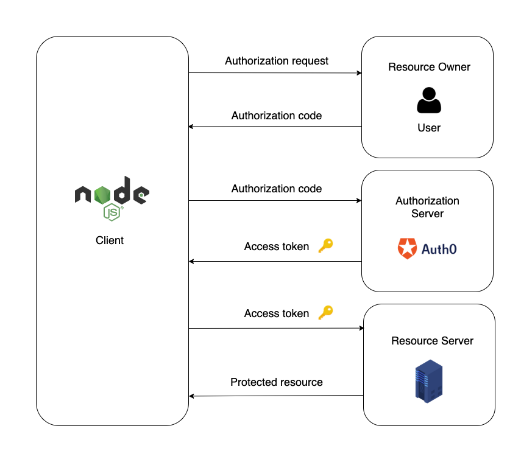

# Auth0 Session Storage

## OAuth 2

OAuth 2 is an authorization framework that enables applications to obtain limited access to user accounts on an HTTP service, such as Facebook, GitHub, and DigitalOcean. It works by delegating user authentication to the service that hosts the user account, and authorizing third-party applications to access the user account.<br/> OAuth 2 provides authorization flows for web and desktop applications, and mobile devices. <br/>
**Reference:** [An Introduction to OAuth2](https://www.digitalocean.com/community/tutorials/an-introduction-to-oauth-2#:~:text=Resource%20Owner%3A%20User,e.g.%20read%20or%20write%20access)



**Requirements:**

- Node.js >= v10.22
- NPM >= v6.14.6
- Docker

## Running application

**1. Install dependencies**

```
$ npm install
```

**2. Create an account configure account on Auth0**

Configure Callback URLs:

A callback URL is a URL in your application where Auth0 redirects the user after they have authenticated.
The value for this example should be: http://localhost:3000/callback

Configure Logout URLs:

A logout URL is a URL in your application that Auth0 can return to after the user has been logged out of the authorization server. This is specified in the returnTo query parameter.
The value for this example should be: http://localhost:3000

**3. Create the `.env` file**

Once you have an account on Auth0 you can get the credentials.


```
AUTH0_CLIENT_ID=
AUTH0_DOMAIN=
AUTH0_CLIENT_SECRET=
AUTH0_CALLBACK_URL=
AUTH0_LOGOUT_URL=
```

**4. Start Redis Docker container**

```
$ npm run redis:start
```

**5. Start application**

```
$ npm start
```
